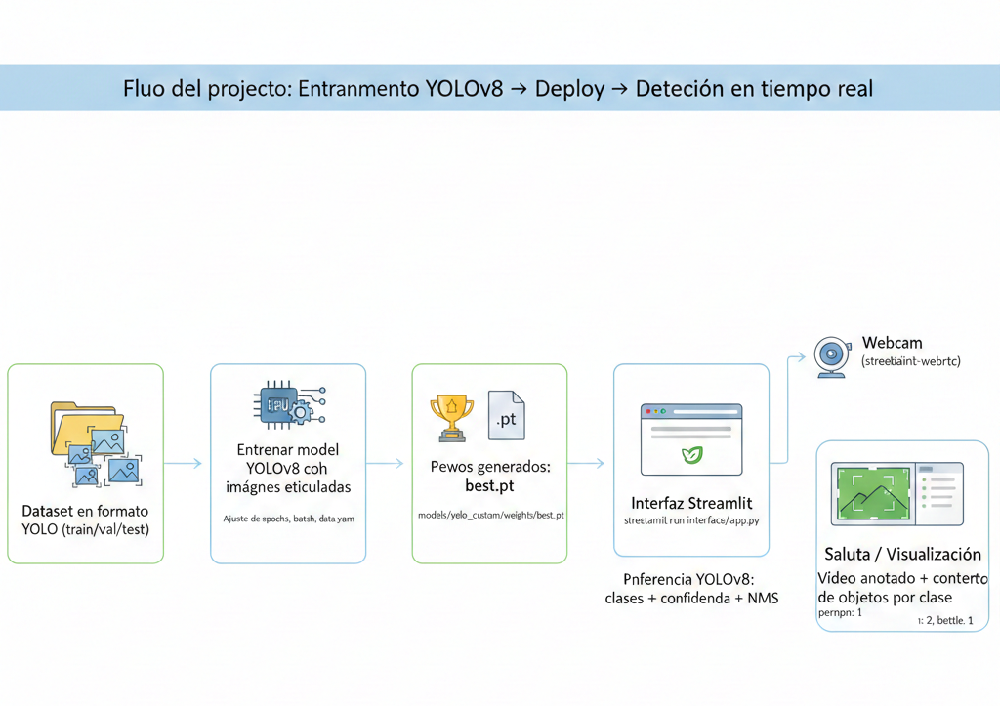

# OBJECT-DETECTION-YOLOv8
 
 Proyecto de **detección de objetos con YOLOv8 (Ultralytics)** con una **interfaz gráfica en Streamlit** que permite:
 
 - **Webcam (tiempo real)**: detección y conteo de clases en directo.
 - **Imagen**: subir una imagen y ver el resultado con bounding boxes.
 - **Vídeo**: subir un vídeo y procesarlo frame a frame.
 
 El modelo por defecto que usa la interfaz es el entrenado en este repo:
 
 - `models/yolo_custom/weights/best.pt`
 
 ---
 
 ## Requisitos
 
 - Python 3.9+ (recomendado)
 - Windows / Linux / macOS
 - (Opcional) GPU NVIDIA con CUDA para acelerar inferencia. En CPU también funciona.
 
 ---
 
 ## Instalación
 
 1) (Recomendado) Crear y activar un entorno virtual
 
 En Windows (PowerShell):
 
 ```bash
 python -m venv entorno
 .\entorno\Scripts\Activate.ps1
 ```
 
 2) Instalar dependencias
 
 ```bash
 pip install -r requirements.txt
 ```
 
 Nota: en `requirements.txt` hay dependencias de visión (OpenCV), Ultralytics (YOLOv8) y la interfaz (`streamlit`, `streamlit-webrtc`, `av`).
 
 ---
 
 ## Cómo ejecutar la interfaz gráfica (Streamlit)
 
 Lanza la app con:
 
 ```bash
 streamlit run interface/app.py
 ```
 
 Se abrirá en el navegador (normalmente `http://localhost:8501`).
 
 ---
 
 ## Uso de la interfaz
 
 En la **barra lateral** puedes:
 
 - Cambiar la **ruta del modelo** (`Ruta del modelo (.pt)`).
 - Ajustar parámetros de inferencia:
   - `conf`: umbral de confianza.
   - `iou`: IoU para NMS.
   - `max_det`: máximo de detecciones por imagen/frame.
 - Elegir el **modo**:
   - `Webcam (tiempo real)`
   - `Imagen`
   - `Vídeo`
 
 En modo **Webcam**:
 
 - Pulsa `START` para activar la cámara.
 - A la derecha se muestran los **conteos por clase** detectada.
 
 En modo **Imagen**:
 
 - Sube un archivo `.jpg`, `.jpeg` o `.png`.
 - Se mostrará la imagen anotada y el conteo de objetos.
 
 En modo **Vídeo**:
 
 - Sube un vídeo (`mp4`, `avi`, `mov`, `mkv`).
 - Se renderiza el resultado mientras se procesa.
 
 ---
 
 ## Estructura del repositorio (resumen)
 
 - `interface/app.py`
   - Interfaz Streamlit (webcam/imagen/vídeo) + inferencia con YOLO.
 - `models/pretrained/`
   - Pesos preentrenados (por ejemplo `yolov8n.pt`).
 - `models/yolo_custom/weights/`
   - Pesos del entrenamiento propio (por defecto `best.pt`).
 - `data/`
   - Dataset en formato YOLO (train/val/test) y `data.yaml`.
 - `notebooks/`
   - Notebook(s) de apoyo/experimentos.
 - `examples/predicted_images/`
   - Ejemplos de salidas (si aplica).
 
 ---
 
 ## Notas y solución de problemas
 
 - **La ruta del modelo no existe**
   - La app muestra un error si el `.pt` no está en la ruta indicada. Verifica que exista `models/yolo_custom/weights/best.pt` o selecciona otro.
 
 - **Webcam no funciona / permisos**
   - Asegúrate de dar permisos al navegador para usar la cámara.
   - Cierra otras apps que estén usando la webcam.
 
 - **Rendimiento**
   - En CPU puede ser más lento. Si tienes GPU/CUDA instalada y PyTorch compatible, la inferencia debería acelerarse.
 
 ---
 
 ## Créditos
 
 - Ultralytics YOLOv8 (`ultralytics`)
 - Streamlit + `streamlit-webrtc` para la captura/procesado en tiempo real


## IMAGEN DEL FLUJO DEL PROYECTO
 